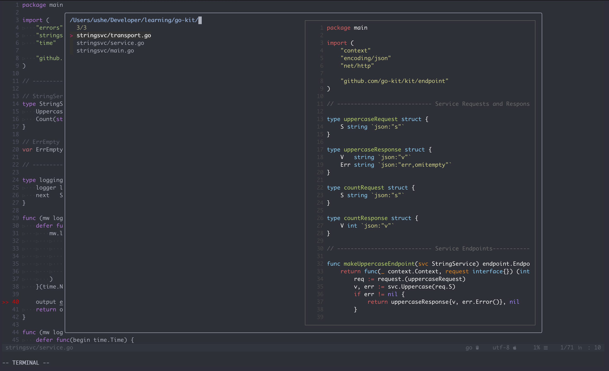

# Developer configs

Development configurations. I've only added my Neovim setup for now.

Neovim is a fork and drop-in replacement for vim. in most cases, you would not notice a difference between the two, other than Neovim allows plugins to run asynchronously so that they do not freeze the editor, which is the main reason I have switched over to it. Vim and Neovim both use Vimscript and most plugins will work in both (all of the plugins I use do work in both Vim and Neovim

